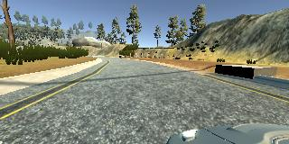
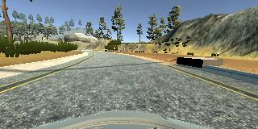
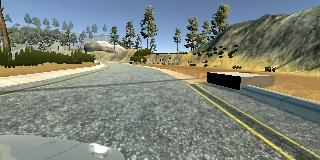
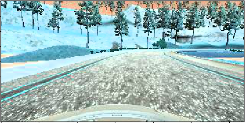
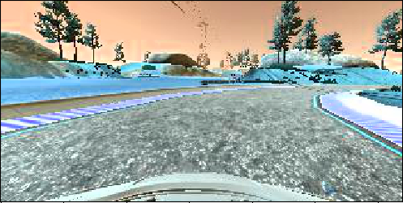
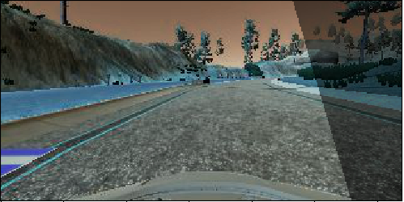

# **Behavioral Cloning** 

## Writeup Template

### You can use this file as a template for your writeup if you want to submit it as a markdown file, but feel free to use some other method and submit a pdf if you prefer.

---

**Behavioral Cloning Project**

The goals / steps of this project are the following:
* Use the simulator to collect data of good driving behavior
* Build, a convolution neural network in Keras that predicts steering angles from images
* Train and validate the model with a training and validation set
* Test that the model successfully drives around track one without leaving the road
* Summarize the results with a written report


[//]: # (Image References)

[image1]: ./examples/placeholder.png "Model Visualization"
[image2]: ./examples/placeholder.png "Grayscaling"
[image3]: ./examples/placeholder_small.png "Recovery Image"
[image4]: ./examples/placeholder_small.png "Recovery Image"
[image5]: ./examples/placeholder_small.png "Recovery Image"
[image6]: ./examples/placeholder_small.png "Normal Image"
[image7]: ./examples/placeholder_small.png "Flipped Image"

## Rubric Points
### Here I will consider the [rubric points](https://review.udacity.com/#!/rubrics/432/view) individually and describe how I addressed each point in my implementation.  

---
### Files Submitted & Code Quality

#### 1. Submission includes all required files and can be used to run the simulator in autonomous mode

My project includes the following files:
* model.py containing the script to create and train the model
* drive.py for driving the car in autonomous mode with speed 15
* model.h5 containing a trained convolution neural network 
* track_1_lap.mp4 video showing the car driving autonomously
* writeup_report.md summarizing the results

#### 2. Submission includes functional code
Using the Udacity provided simulator and my drive.py file, the car can be driven autonomously around the track by executing 
```sh
python drive.py model.h5
```

#### 3. Submission code is usable and readable

The model.py file contains the code for training and saving the convolution neural network. The file shows the pipeline I used for training and validating the model, and it contains comments to explain how the code works.

### Model Architecture and Training Strategy

#### 1. An appropriate model architecture has been employed

My model applies a combination of the Keras framework and NVidias Convolutional Neural Network as proposed in the tutorials. 

#### 2. Attempts to reduce overfitting in the model

By splitting the data in training and validation sets and keeping the epochs number low (3 epochs only) as proposed in the tutorials, there was no need to apply any overfitting features like dropout or pooling.

#### 3. Model parameter tuning

The model used mse loss and adam optimizer, so the learning rate was not tuned manually (model.py line 102).

#### 4. Appropriate training data

In order to train the data i drove the car four laps in total, two laps forward and two laps backwards. I was driving the car in slaloms, meaning that i was not driving the car straight, i was continuously go left and right in order to gain more data from all the camers left, right and center.

For details about how I created the training data, see the next section. 

### Model Architecture and Training Strategy

#### 1. Solution Design Approach

The first step when i created the model, was to create a lamba layer to preprocess the data with input (160, 320, 3), flatten and dense of 1 and train it on 5 epochs by using the default data provided in the tutorials. The result was the car to drive around itself before diving into the water.
Then i decided to drive straight around the track one lap and get more data. After i decided to use the LeNet architecture and apply 
two convulation layers of (6, 5, 5) with relu activation, two max pooling layers and change the dense to 120, 84 and 1. The result was
the car to make it up to the second left turn before going out of the track, which means it passed the first left turn and the bridge.
Then i decided to collect more data by dring around the track two laps, only this time i didn't just drive straight i continuously drove left and right in slaloms in order to capture more data. On the same model the car made it again up to the second left turn, but then i decided to switch to Nvidias model by applying more convolution layers and different denses. So now i had five layers in total (you can see the final model below) and the result was that the car made halfway to the right turn before diving into the water.
Then like my mentor suggested is should extract more data from the images, so i applied brightness and shadow features which would enhance the data. After that i decided to train again the car by driving four laps in total again in slaloms, only this time i drove two laps forward and two laps backwards in order to get more data on right turns too.
The result was that the car succesfully drove a whole lap by itself.

#### 2. Final Model Architecture

Here is the step by step procedure of the final model:
  - Lambada layer data preprocessing with input (160, 320, 5)
  - Image Cropping 50 pixels top, 20 pixels bottom
  - Convolution layer (24, 5, 5) relu activation
  - Convolution layer (36, 5, 5) relu activation
  - Convolution layer (48, 5, 5) relu activation
  - Convolution layer (64, 3, 3) 
  - Convolution layer (64, 3, 3) 
  - Flatten
  - Dense 100
  - Dense 50
  - Dense 10
  - Dense 1
  
Training parameters:
  - Loss mse
  - Optimizer adam
  - Epochs 3

#### 3. Creation of the Training Set & Training Process

Like mentioned before in order to get enough data i drove laps forward and backwards in slaloms. Here you what the cameras captured.

The camera on the left:


The camera on the center:


The camera on the right:


In order to extract more data i added brightness and shadow features like mentioned before. Here is an image after the brightness feature:


And here after the shadow:


And here is an image flipped for the final step:


I finally randomly shuffled the data. The final training was done using only three epochs and the car drove a whole lap by itself.
